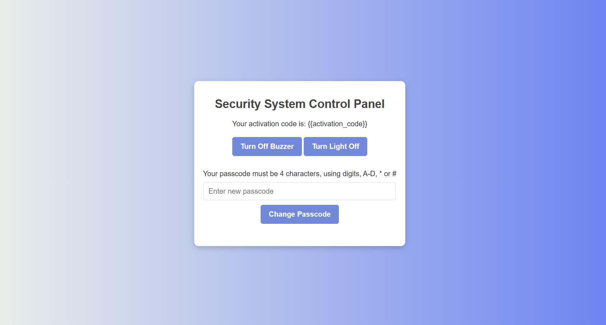

# Security Lock System

   

An embedded access-control system built around an Arduino Mega, combining a motion-activated keypad, an LCD, a servo-driven lock, and a Bluetooth link to a Flask web dashboard for remote monitoring and control. After too many failed password attempts, the system locks itself and requires a server-generated activation code — sent to the Arduino over Bluetooth and stored in Redis — for re-entry.

## Demo



*The Flask-based control panel: displays the current activation code and lets a user remotely turn off the buzzer or the light.*

## Features

- **Motion-activated keypad** — the keypad/LCD only wake on motion detection, saving power
- **Lockout + activation code recovery** — after 3 failed attempts, the system locks and requires a unique, server-generated activation code to unlock
- **Remote control via web dashboard** — turn off the buzzer or light remotely through a Flask-based control panel
- **Real-time notifications** — Socket.IO pushes activation code updates and security alerts (wrong password, access granted) to the browser instantly
- **Persistent activation codes** — stored in Redis so codes survive server restarts
- **Bluetooth communication** — HC-05 module links the Arduino to the Flask backend

## How It Works

1. **Idle state** — the motion sensor wakes the LCD/keypad only when someone approaches.
2. **Password entry** — the user enters a 4-character password on the keypad (digits, A–D, `*`, `#`).
3. **Access granted** — on a correct password, the servo unlocks the door and the Flask backend is notified over Bluetooth.
4. **Lockout** — after 3 wrong attempts, the buzzer and red LED activate, and the Arduino signals `"System Locked"` to the backend.
5. **Activation code recovery** — Flask generates a random 4-character activation code, stores it in Redis, and sends it back to the Arduino over Bluetooth. The code is also pushed live to the web dashboard via Socket.IO.
6. **Unlock** — entering the matching activation code on the keypad unlocks the system and resets it to idle.

## Repository Structure

```
security-lock-system/
├─ README.md
├─ requirements.txt
├─ arduino/
│  └─ lock_system.ino
├─ media/
│  └─ demo_screenshot.png
└─ python/
   ├─ app.py
   └─ templates/
      └─ index.html
```

## Requirements

- Flask==3.1.3
- Flask-SocketIO==5.6.1
- pyserial==3.5
- redis==8.1.0
- A running Redis server (local or remote)
- Arduino Mega with: keypad, LCD (I2C), servo motor, motion sensor, RGB LED, buzzer, HC-05 Bluetooth module

## How to Run

1. Clone the repository:
   ```bash
   git clone https://github.com/JanaM-10/security-lock-system.git
   cd security-lock-system
   ```
2. Install Python dependencies:
   ```bash
   cd python
   pip install -r ../requirements.txt
   ```
3. Set up a Redis server (local or remote) and make sure it's running.
4. Upload `arduino/lock_system.ino` to your Arduino board using the Arduino IDE.
5. Update the Bluetooth COM port in `app.py` to match your setup.
6. Run the Flask app:
   ```bash
   python app.py
   ```
7. Open the dashboard at: `http://127.0.0.1/`

## Usage

- View the current activation code and receive live security notifications from the web dashboard
- Remotely turn off the buzzer or light
- Monitor access attempts and lockout events in real time

## Notes

- Ensure the Arduino is paired and connected via Bluetooth (HC-05) before starting the Flask app
- Activation codes are generated server-side and stored in Redis; they update live on the dashboard
- Motion detection keeps the keypad/LCD off when idle to save power

## Future Improvements

- Move Redis host and serial port configuration to environment variables instead of hardcoding
- Add physical build photos to `media/`
- Finish and re-enable the in-browser passcode-change feature (currently backend-only)
- Add automatic COM-port detection instead of a fixed port

## Components Used

- Arduino Mega
- 4×4 Matrix Keypad
- 16×2 I2C LCD Display
- Servo Motor (lock mechanism)
- PIR Motion Sensor
- RGB LED
- Buzzer
- HC-05 Bluetooth Module
